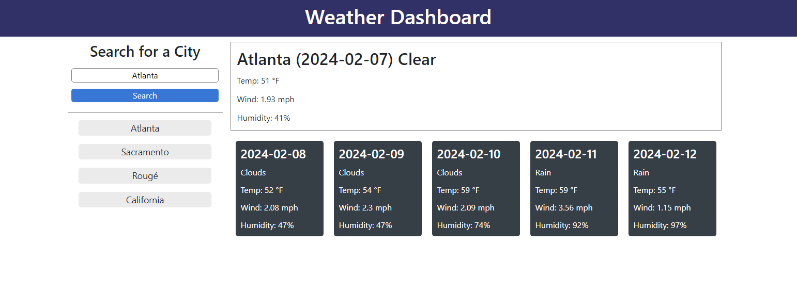

# WEATHER DASHBOARD

## Description

The Weather Dashboard app allows users to search for specific cities and return current and future weather forcasts for that city. Data displayed includes humidity, highs and lows, as well clarity (clouds, rain, sun, ect). Perviously viewed cities will also appear on the side, with a limit of 10 at a time.

## Usage

To use the application, enter a city name into the search bar, then click the search button. The city you are searching for *should* appear on the right, with the 5-day forecast appearing below.

The app can be found at:

https://mattmrob.github.io/Weather-Dashboard/

## Bugs / Issues

The city search only take a name, and considering many cities have the same name, results may not be consistant with what you are looking for. The more unique or stand-out your city is, the more likely the result will be accurate.

## Credits

UC Berkely

## License

MIT License